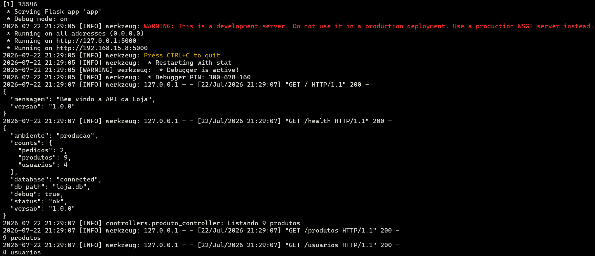
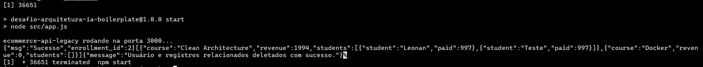
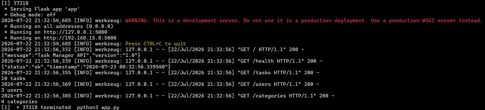

# Criação de Skills — Refatoração Arquitetural Automatizada

Ao longo do curso você aprendeu o que são Skills e como elas permitem que um agente de IA atue como um especialista em tarefas específicas. Agora imagine o seguinte cenário: você herdou 3 projetos legados com problemas de arquitetura, segurança e qualidade de código. Revisar e corrigir tudo manualmente levaria dias.

Neste desafio, você vai criar uma Skill que automatiza esse processo — analisando, auditando e refatorando qualquer projeto para o padrão MVC, independente da tecnologia.

## Objetivo

Você deve entregar uma Skill capaz de:

- Analisar uma codebase detectando linguagem, framework e arquitetura atual
- Identificar anti-patterns e code smells, classificando por severidade com arquivo e linha exatos
- Gerar um relatório de auditoria estruturado com todos os achados
- Refatorar o projeto para o padrão MVC (Model-View-Controller), eliminando os problemas encontrados
- Validar o resultado garantindo que a aplicação continua funcionando após as mudanças

A skill deve ser agnóstica de tecnologia, funcionando com diferentes linguagens e frameworks.

## Contexto

### Definição de Severidades

Para padronizar a sua auditoria e os relatórios gerados pela IA, utilize a seguinte escala de classificação baseada em problemas de MVC e SOLID:

- **CRITICAL:** Falhas graves de arquitetura ou segurança que impedem o funcionamento correto, expõem dados sensíveis (ex: credenciais hardcoded, SQL Injection) ou violam completamente a separação de responsabilidades (ex: "God Class" contendo banco de dados, lógicas complexas e roteamento no mesmo arquivo).
- **HIGH:** Fortes violações do padrão MVC ou princípios SOLID que dificultam muito a manutenção e testes (ex: lógicas de negócio pesadas presas dentro de Controllers, forte acoplamento sem Injeção de Dependência, ou uso de estado global mutável em toda a aplicação).
- **MEDIUM:** Problemas de padronização, duplicação de código ou gargalos de performance moderada (ex: Queries N+1 no banco de dados, uso inadequado de middlewares, validações ausentes nas rotas).
- **LOW:** Melhorias de legibilidade, nomenclatura de variáveis ruins, ou "magic numbers" soltos pelo código.

### Exemplo de Uso no CLI

```bash
# Executar a skill no projeto com problemas
cd code-smells-project
claude "/refactor-arch"
```

```
================================
PHASE 1: PROJECT ANALYSIS
================================
Language:      Python
Framework:      Flask 3.1.1
Dependencies:  flask-cors
Domain:        E-commerce API (produtos, pedidos, usuários)
Architecture:  Monolítica — tudo em 4 arquivos, sem separação de camadas
Source files:  4 files analyzed
DB tables:     produtos, usuarios, pedidos, itens_pedido
================================
```

```
================================
ARCHITECTURE AUDIT REPORT
================================
Project: code-smells-project
Stack:   Python + Flask
Files:   4 analyzed | ~800 lines of code

## Summary
CRITICAL: 4 | HIGH: 5 | MEDIUM: 2 | LOW: 3

## Findings

### [CRITICAL] God Class / God Method
File: models.py:1-350
Description: Arquivo único contém toda lógica de negócio, queries SQL, validação e formatação para 4 domínios diferentes.
Impact: Impossível testar em isolamento, qualquer mudança afeta tudo.
Recommendation: Separar em models e controllers por domínio.

### [CRITICAL] Hardcoded Credentials
File: app.py:8
Description: SECRET_KEY hardcoded como 'minha-chave-super-secreta-123'
...

================================
Total: 14 findings
================================

Phase 2 complete. Proceed with refactoring (Phase 3)? [y/n]
> y
```

```
[... refatoração executada ...]

================================
PHASE 3: REFACTORING COMPLETE
================================
## New Project Structure
src/
├── config/settings.py
├── models/
│   ├── produto_model.py
│   └── usuario_model.py
├── views/
│   └── routes.py
├── controllers/
│   ├── produto_controller.py
│   └── pedido_controller.py
├── middlewares/error_handler.py
└── app.py (composition root)

## Validation
  ✓ Application boots without errors
  ✓ All endpoints respond correctly
  ✓ Zero anti-patterns remaining
================================
```

## Tecnologias obrigatórias

- **Ferramenta:** uma das três opções abaixo (não são aceitas outras ferramentas):
  - Claude Code
  - Gemini CLI
  - OpenAI Codex
- **Recurso:** Custom Skills (ou o equivalente na ferramenta escolhida)
- **Formato dos arquivos de referência:** Markdown
- **Projetos-alvo:** Python/Flask (2 projetos) e Node.js/Express (1 projeto) (fornecidos no repositório base)

> **Nota sobre a ferramenta:** Os exemplos deste documento usam o Claude Code (`.claude/skills/`) como referência, pois é a ferramenta utilizada no curso. Se você optar por Gemini CLI ou Codex, adapte o nome da pasta e o comando de invocação conforme a convenção dela — o conceito de skill e a estrutura interna (SKILL.md + arquivos de referência) permanecem os mesmos.

## Requisitos

### 1. Análise Manual dos Projetos

Antes de criar a skill, você deve entender os problemas que ela vai resolver.

**Tarefas:**

- Analisar o projeto `code-smells-project/` (Python/Flask — API de E-commerce)
- Analisar o projeto `ecommerce-api-legacy/` (Node.js/Express — LMS API com fluxo de checkout)
- Analisar o projeto `task-manager-api/` (Python/Flask — API de Task Manager)

Para cada projeto, identificar e documentar no mínimo 5 problemas, incluindo pelo menos:

- 1 de severidade CRITICAL ou HIGH
- 2 de severidade MEDIUM
- 2 de severidade LOW

Documentar os achados na seção "Análise Manual" do seu `README.md`

> **Dica:** Não precisa encontrar todos os problemas — foque nos que têm maior impacto arquitetural. Use os projetos como insumo para entender quais padrões sua skill precisa detectar.

> **Por que 3 projetos?** Dois são Python/Flask (com níveis de organização diferentes) e um é Node.js/Express. Sua skill precisa funcionar nos 3 para provar que é verdadeiramente agnóstica de tecnologia — lidando tanto com código completamente desestruturado quanto com projetos que já possuem alguma separação de camadas.

### 2. Criação da Skill

Agora que você conhece os problemas, crie uma skill que os detecte, gere um relatório de auditoria e corrija automaticamente.

**Tarefas:**

Criar a skill dentro do projeto `code-smells-project/` e implementar o SKILL.md com 3 fases sequenciais:

- **Fase 1 — Análise:** Detectar stack, mapear arquitetura atual, imprimir resumo
- **Fase 2 — Auditoria:** Cruzar código contra catálogo de anti-patterns, gerar relatório, pedir confirmação
- **Fase 3 — Refatoração:** Reestruturar para o padrão MVC, validar que funciona

Criar arquivos de referência em Markdown que forneçam à skill o conhecimento necessário para executar as 3 fases. Os arquivos devem cobrir **obrigatoriamente** as seguintes áreas de conhecimento:

| Área de conhecimento | O que deve conter |
|---|---|
| Análise de projeto | Heurísticas para detecção de linguagem, framework, banco de dados e mapeamento de arquitetura |
| Catálogo de anti-patterns | Anti-patterns com sinais de detecção e classificação de severidade |
| Template de relatório | Formato padronizado do relatório de auditoria (Fase 2) |
| Guidelines de arquitetura | Regras do padrão MVC alvo (camadas Models, Views/Routes e Controllers, responsabilidades de cada uma) |
| Playbook de refatoração | Padrões concretos de transformação para cada anti-pattern (com exemplos de código) |

> **Nota:** Você tem liberdade para organizar os arquivos de referência como preferir — pode usar os nomes e a quantidade de arquivos que fizer sentido para sua skill. O importante é que todas as 5 áreas de conhecimento estejam cobertas. O nome da skill (`refactor-arch`) e o arquivo `SKILL.md` são obrigatórios e não devem ser alterados. O path da skill segue a convenção da ferramenta escolhida (no Claude Code, por exemplo, é `.claude/skills/refactor-arch/`).

**Requisitos da skill:**

- Deve ser agnóstica de tecnologia — deve funcionar corretamente nos 3 projetos fornecidos, independente da stack ou nível de organização
- O catálogo de anti-patterns deve conter no mínimo 8 anti-patterns com severidade distribuída (CRITICAL, HIGH, MEDIUM, LOW)
- O catálogo deve incluir detecção de APIs deprecated — identificar uso de APIs obsoletas e recomendar o equivalente moderno
- O playbook deve ter no mínimo 8 padrões de transformação com exemplos de código antes/depois
- A Fase 2 deve pausar e pedir confirmação antes de modificar qualquer arquivo
- A Fase 3 deve validar o resultado (boot da aplicação + endpoints funcionando)

### 3. Execução da Skill

Execute sua skill nos 3 projetos e valide que ela funciona em todas as stacks.

#### Projeto 1 — code-smells-project (Python/Flask)

Invocar a skill no Claude Code:

```bash
claude "/refactor-arch"
```

> **Nota:** O comando acima é o exemplo com Claude Code. Se você estiver usando Gemini CLI ou Codex, utilize o comando equivalente para invocar uma skill na sua ferramenta.

- Verificar que a Fase 1 detecta corretamente a stack e imprime o resumo
- Verificar que a Fase 2 encontra no mínimo 5 dos problemas documentados na sua análise manual
- Confirmar a execução da Fase 3
- Verificar que a Fase 3:
  - Cria a estrutura de diretórios baseada em MVC
  - A aplicação inicia sem erros
  - Os endpoints originais continuam respondendo
- Salvar o relatório de auditoria (output da Fase 2) em `reports/audit-project-1.md`
- Commitar o código refatorado do projeto no repositório

#### Projeto 2 — ecommerce-api-legacy (Node.js/Express)

Prove que sua skill é reutilizável em outro projeto de backend, mas com stack diferente.

- Copiar a pasta `.claude/skills/refactor-arch/` para dentro de `ecommerce-api-legacy/`
- Invocar a skill:

```bash
cd ../ecommerce-api-legacy
claude "/refactor-arch"
```

- Verificar que as 3 fases executam corretamente neste projeto
- Salvar o relatório em `reports/audit-project-2.md`
- Commitar o código refatorado do projeto no repositório

#### Projeto 3 — task-manager-api (Python/Flask)

Agora o teste com um projeto Python/Flask que já possui alguma organização de camadas (models, routes, services, utils).

- Copiar a pasta `.claude/skills/refactor-arch/` para dentro de `task-manager-api/`
- Invocar a skill:

```bash
cd ../task-manager-api
claude "/refactor-arch"
```

- Verificar que:
  - A Fase 1 detecta corretamente Python/Flask como stack e identifica o domínio de Task Manager
  - A Fase 2 identifica problemas mesmo em um projeto parcialmente organizado
  - A Fase 3 melhora a estrutura sem quebrar a aplicação (todos os endpoints devem continuar respondendo)
- Salvar o relatório em `reports/audit-project-3.md`
- Commitar o código refatorado do projeto no repositório

> **Nota:** Este projeto já possui alguma separação de camadas, mas isso não significa que a arquitetura está adequada. A skill deve identificar tanto problemas de código (segurança, performance, qualidade) quanto oportunidades de melhoria arquitetural. Se houver mudanças estruturais necessárias, a skill deve propô-las e executá-las.

#### Validação

Para cada projeto refatorado, valide o seguinte checklist:

```markdown
## Checklist de Validação

### Fase 1 — Análise
- [ ] Linguagem detectada corretamente
- [ ] Framework detectado corretamente
- [ ] Domínio da aplicação descrito corretamente
- [ ] Número de arquivos analisados condiz com a realidade

### Fase 2 — Auditoria
- [ ] Relatório segue o template definido nos arquivos de referência
- [ ] Cada finding tem arquivo e linhas exatos
- [ ] Findings ordenados por severidade (CRITICAL → LOW)
- [ ] Mínimo de 5 findings identificados
- [ ] Detecção de APIs deprecated incluída (se aplicável)
- [ ] Skill pausa e pede confirmação antes da Fase 3

### Fase 3 — Refatoração
- [ ] Estrutura de diretórios segue padrão MVC
- [ ] Configuração extraída para módulo de config (sem hardcoded)
- [ ] Models criados para abstrair dados
- [ ] Views/Routes separadas para visualização ou roteamento
- [ ] Controllers concentram o fluxo da aplicação
- [ ] Error handling centralizado
- [ ] Entry point claro
- [ ] Aplicação inicia sem erros
- [ ] Endpoints originais respondem corretamente
```

> **Dica:** Se a skill não detectou problemas suficientes ou a refatoração falhou, ajuste os arquivos de referência e execute novamente. É normal precisar de 2-4 iterações.

## Entregável

Repositório público no GitHub (fork do repositório base) contendo:

- Skill completa em `.claude/skills/refactor-arch/` (dentro dos 3 projetos)
- Código refatorado dos 3 projetos (resultado da execução da Fase 3, commitado no repositório)
- Relatórios de auditoria em `reports/` (3 arquivos)
- `README.md` atualizado

### Estrutura do repositório

Faça um fork do repositório base contendo os três projetos com code smells.

> **Nota:** A estrutura abaixo usa Claude Code como exemplo (`.claude/skills/`). Se estiver usando outra ferramenta, adapte os caminhos conforme a convenção dela.

```
desafio-skills/
├── README.md                              # Sua documentação
│
├── code-smells-project/                   # Projeto 1 — Python/Flask (API de E-commerce)
│   ├── .claude/
│   │   └── skills/
│   │       └── refactor-arch/             # ← SUA SKILL AQUI
│   │           ├── SKILL.md
│   │           └── (arquivos de referência)
│   ├── app.py
│   ├── controllers.py
│   ├── models.py
│   ├── database.py
│   └── requirements.txt
│
├── ecommerce-api-legacy/                  # Projeto 2 — Node.js/Express (LMS API com checkout)
│   ├── .claude/
│   │   └── skills/
│   │       └── refactor-arch/             # ← CÓPIA DA SKILL
│   │           └── ...
│   ├── src/
│   │   ├── app.js
│   │   ├── AppManager.js
│   │   └── utils.js
│   ├── api.http
│   └── package.json
│
├── task-manager-api/                      # Projeto 3 — Python/Flask (API de Task Manager)
│   ├── .claude/
│   │   └── skills/
│   │       └── refactor-arch/             # ← CÓPIA DA SKILL
│   │           └── ...
│   ├── app.py
│   ├── database.py
│   ├── seed.py
│   ├── requirements.txt
│   ├── models/
│   ├── routes/
│   ├── services/
│   └── utils/
│
└── reports/                               # Relatórios gerados
    ├── audit-project-1.md                 # Saída da Fase 2 no projeto 1
    ├── audit-project-2.md                 # Saída da Fase 2 no projeto 2
    └── audit-project-3.md                 # Saída da Fase 2 no projeto 3
```

**O que você vai criar:**

- `.claude/skills/refactor-arch/` — A skill completa (SKILL.md + arquivos de referência)
- Código refatorado dos 3 projetos — resultado da execução da Fase 3, commitado no repositório
- `reports/audit-project-{1,2,3}.md` — Relatório de auditoria de cada projeto
- `README.md` — Documentação do seu processo

**O que já vem pronto:**

- `code-smells-project/` — API de E-commerce Python/Flask com code smells intencionais
- `ecommerce-api-legacy/` — LMS API Node.js/Express (com fluxo de checkout) e problemas de implementação
- `task-manager-api/` — API de Task Manager Python/Flask com organização parcial e problemas de segurança/qualidade

> **Dica:** Cada projeto contém problemas intencionais de diferentes severidades (CRITICAL, HIGH, MEDIUM, LOW), incluindo falhas de segurança, violações arquiteturais e problemas de qualidade de código. Parte do desafio é identificá-los por conta própria através da análise manual do código.

### README.md deve conter

**A) Seção "Análise Manual":**

- Lista dos problemas identificados manualmente em cada projeto
- Classificação por severidade
- Justificativa de por que cada problema é relevante

**B) Seção "Construção da Skill":**

- Decisões de design: como estruturou o SKILL.md e os arquivos de referência
- Quais anti-patterns incluiu no catálogo e por quê
- Como garantiu que a skill é agnóstica de tecnologia
- Desafios encontrados e como resolveu

**C) Seção "Resultados":**

- Resumo dos relatórios de auditoria dos 3 projetos (quantos findings por severidade em cada)
- Comparação antes/depois da estrutura de cada projeto
- Checklist de validação preenchido para cada projeto
- Screenshots ou logs mostrando as aplicações rodando após refatoração
- Observações sobre como a skill se comportou em stacks diferentes

**D) Seção "Como Executar":**

- Pré-requisitos (a ferramenta escolhida — Claude Code, Gemini CLI ou Codex — instalada e configurada)
- Comandos para executar a skill em cada projeto
- Como validar que a refatoração funcionou

### Ordem de execução sugerida

**1. Analisar os projetos manualmente**

Leia o código dos três projetos e documente os problemas encontrados.

**2. Criar a skill**

Escreva o SKILL.md e os arquivos de referência.

**3. Executar nos 3 projetos**

```bash
# Projeto 1
cd code-smells-project
claude "/refactor-arch"

# Projeto 2
cd ../ecommerce-api-legacy
claude "/refactor-arch"

# Projeto 3
cd ../task-manager-api
claude "/refactor-arch"
```

Salve a saída da Fase 2 de cada projeto em `reports/audit-project-{1,2,3}.md`.

**4. Iterar**

Se a skill não detectou problemas suficientes ou a refatoração falhou, ajuste os arquivos de referência e execute novamente. É normal precisar de 2-4 iterações.

## Critérios de Aceite

A skill deve atingir os seguintes mínimos em **todos os 3 projetos**:

| Critério | Requisito |
|---|---|
| Fase 1 detecta stack corretamente | OBRIGATÓRIO (3/3 projetos) |
| Fase 2 encontra >= 5 findings | OBRIGATÓRIO (3/3 projetos) |
| Fase 2 inclui pelo menos 1 CRITICAL ou HIGH | OBRIGATÓRIO (3/3 projetos) |
| Fase 3 aplicação funciona após refatoração | OBRIGATÓRIO (3/3 projetos) |

**IMPORTANTE:** Todos os critérios devem ser atingidos nos 3 projetos, não apenas em um!

> **Sobre o projeto 3 (task-manager-api):** Este projeto já possui alguma organização. "aplicação funciona" significa que a API inicia sem erros e todos os endpoints continuam respondendo corretamente.

## Referências

- [Claude Code: Skills](https://docs.anthropic.com/en/docs/claude-code/skills) — Documentação oficial sobre como criar e estruturar Skills
- [Claude Code: Overview](https://docs.anthropic.com/en/docs/claude-code/overview) — Visão geral do Claude Code e suas capacidades
- [The Complete Guide to Building Skills for Claude (PDF)](https://resources.anthropic.com/hubfs/The-Complete-Guide-to-Building-Skill-for-Claude.pdf) — Guia completo da Anthropic sobre construção de Skills
- [Equipping Agents for the Real World with Agent Skills](https://claude.com/blog/equipping-agents-for-the-real-world-with-agent-skills) — Blog oficial da Anthropic sobre Agent Skills

---

## Dicas Finais

- **Comece pela análise manual** — entender os problemas profundamente é essencial para criar uma skill que os detecte.
- **O SKILL.md é um prompt** — ele instrui o agente sobre o que fazer, enquanto os arquivos de referência fornecem o conhecimento de domínio.
- **Seja específico nos sinais de detecção** — "código ruim" não ajuda; "query SQL dentro de loop for" é acionável.
- **Teste incrementalmente** — não tente criar a skill perfeita de primeira.
- **A skill deve ser copiável** — se ela só funciona em um projeto específico, está acoplada demais. Teste nos 3 projetos para validar.
- **Projetos diferentes exigem adaptação** — a Fase 3 de um projeto já parcialmente organizado não vai ter as mesmas transformações de um monolito. Sua skill deve se adaptar ao contexto.
- **Pedir confirmação na Fase 2 é obrigatório** — o humano deve revisar o relatório antes de qualquer modificação.
- **Consulte as referências do curso** — revise a documentação oficial da ferramenta escolhida e os materiais das aulas para relembrar a estrutura e anatomia de uma skill.

---

## A) Análise Manual

### code-smells-project (Python/Flask — API de E-commerce)

Problemas identificados manualmente no código legado, antes da refatoração:

- **CRITICAL:**
  - `app.py`: `SECRET_KEY` hardcoded (`'minha-chave-super-secreta-123'`). *Relevância:* qualquer pessoa com acesso ao repositório pode forjar sessões e comprometer a aplicação.
  - `models.py`: SQL Injection em todos os métodos CRUD por concatenação direta de strings. *Relevância:* um atacante pode destruir ou extrair todo o banco de dados via parâmetros da URL.
  - `app.py`: Endpoint `/admin/query` permite execução de queries SQL arbitrárias. *Relevância:* acesso total irrestrito ao banco de dados.
- **HIGH:**
  - `controllers.py`: God Class — lógica de 4 domínios (produtos, usuários, pedidos, relatórios) em um único arquivo de 250 linhas. *Relevância:* qualquer mudança afeta todos os domínios, impossível testar isoladamente.
  - `app.py`: `debug=True` ativado. *Relevância:* expõe stack traces detalhados ao usuário final em produção.
- **MEDIUM:**
  - `models.py`: N+1 queries em `get_pedidos_usuario`. *Relevância:* com 100 pedidos, o banco recebe 101 queries em vez de 1.
  - `models.py`: Senha armazenada sem hash seguro. *Relevância:* vazamento do banco expõe todas as credenciais em texto puro.
  - `controllers.py`: Tratamento de erros inconsistente — `except` genérico retorna `str(e)` para o cliente. *Relevância:* vaza detalhes da estrutura interna da aplicação.
- **LOW:**
  - `controllers.py`: Uso de `print()` para logging. *Relevância:* sem níveis de log, não é possível filtrar mensagens em produção.
  - `app.py`: Validações de input dispersas pelo código. *Relevância:* aumenta o risco de falhas de validação em novos endpoints.

### ecommerce-api-legacy (Node.js/Express — LMS API)

- **CRITICAL:**
  - `AppManager.js`: SQL Injection em todas as queries (concatenação direta). *Relevância:* permite injeção de comandos maliciosos no banco SQLite.
  - `AppManager.js`: Credenciais de gateway de pagamento hardcoded. *Relevância:* expõe chave de pagamento real no repositório.
  - `AppManager.js`: God Class — um único arquivo gerencia DB, rotas, lógica de negócio e relatórios. *Relevância:* impossível manter ou testar separadamente.
- **HIGH:**
  - `AppManager.js`: Criptografia insegura (`badCrypto`). *Relevância:* senhas podem ser revertidas com esforço mínimo.
  - `AppManager.js`: Falta de validação robusta de entradas. *Relevância:* dados malformados podem quebrar o fluxo de checkout.
- **MEDIUM:**
  - `AppManager.js`: Gerenciamento inconsistente de erros. *Relevância:* vazamento de status interno do banco para o cliente.
  - `utils.js`: Lógica acoplada e pouco testável. *Relevância:* impossível mockar dependências em testes.
- **LOW:**
  - `AppManager.js`: `console.log` para transações sensíveis. *Relevância:* logs de pagamento sem estrutura nem níveis.
  - `AppManager.js`: Código sem indentação consistente. *Relevância:* dificulta a leitura e manutenção.

### task-manager-api (Python/Flask — API de Task Manager)

- **CRITICAL:**
  - `app.py`: `SECRET_KEY` hardcoded como fallback (`'default-dev-key'`). *Relevância:* se a env var não for configurada, a chave é trivialmente adivinhável.
  - `app.py`: `debug=True` ativado. *Relevância:* stack traces expostos em produção.
- **HIGH:**
  - `routes/task_routes.py`: Fat Routes — lógica de negócio, validação e transformação de dados misturadas nas rotas. *Relevância:* impossível testar a lógica sem fazer requisição HTTP.
- **MEDIUM:**
  - `routes/task_routes.py`: N+1 queries — carregamento de `user_name` e `category_name` em loop dentro de `get_tasks`. *Relevância:* com 100 tasks, 201 queries em vez de 3.
  - `routes/task_routes.py`: Falta de logging estruturado (uso excessivo de `print`). *Relevância:* sem níveis de log para debugging.
  - `routes/task_routes.py`: Tratamento de erros genérico. *Relevância:* erros específicos são mascarados, dificultando diagnóstico.
- **LOW:**
  - `routes/task_routes.py`: Validações repetitivas espalhadas. *Relevância:* se a regra de validação mudar, vários lugares precisam ser alterados.

---

## B) Construção da Skill

### Decisões de Design

A skill `refactor-arch` foi estruturada em 3 fases sequenciais (Análise → Auditoria → Refatoração), cada uma com seu próprio arquivo de referência:

| Fase | Arquivo de Referência | Propósito |
|------|----------------------|-----------|
| 1 — Análise | `references/analysis_heuristics.md` | Heurísticas para detectar linguagem, framework, banco e arquitetura |
| 2 — Auditoria | `references/anti_patterns.md` + `references/audit_template.md` | Catálogo de 10 anti-patterns com severidade + template do relatório |
| 3 — Refatoração | `references/mvc_guidelines.md` + `references/refactoring_playbook.md` | Diretrizes MVC + 8 padrões de transformação com código antes/depois |

Optou-se por **separar o conhecimento por fase** em vez de um único arquivo monolítico, pois:
1. Cada fase tem um propósito distinto e requer informações diferentes
2. Facilita a manutenção — ajustar uma fase não impacta as outras
3. A skill pode referenciar o arquivo específico da fase em execução, sem poluir o contexto

### Anti-patterns no Catálogo

O catálogo contém **10 anti-patterns** com severidade distribuída:

| Anti-pattern | Severidade | Por que foi incluído |
|---|---|---|
| God Class | CRITICAL | Presente nos 3 projetos — o problema mais comum em código legado |
| Hardcoded Credentials | CRITICAL | Risco de segurança mais grave |
| SQL Injection | CRITICAL | Presente em 2 dos 3 projetos |
| Fat Controller | HIGH | Violação direta do MVC |
| Tight Coupling | HIGH | Impede testes e reúso |
| N+1 Queries | MEDIUM | Problema de performance comum |
| Duplicate Code | MEDIUM | Aumenta custo de manutenção |
| Deprecated API | MEDIUM | Presente no task-manager-api (MD5) |
| Magic Numbers | LOW | Reduz legibilidade |
| Inconsistent Naming | LOW | Dificulta compreensão do código |

### Agnosticidade de Tecnologia

Para garantir que a skill funciona em Python e Node.js, as seguintes decisões foram tomadas:

- **Heurísticas de detecção:** a Fase 1 usa arquivos de manifesto (`requirements.txt`, `package.json`) para identificar a stack, sem assumir nenhuma linguagem específica
- **Anti-patterns descritos por comportamento:** "lógica de negócio na rota" é detectável em Flask e Express, independente da sintaxe
- **Playbook com exemplos genéricos:** os padrões de transformação mostram o conceito (ex: "extrair config para env vars") em vez de código específico de framework
- **Estrutura alvo flexível:** o MVC é aplicado com a nomenclatura apropriada para cada linguagem (`controllers/` em Python, `Controllers.js` em Node)

### Desafios Encontrados

1. **Rotas vs Views:** O padrão MVC tradicional tem "Views" para renderização, mas APIs REST não renderizam HTML. Optou-se por tratar `routes/` como a camada de View (definição de endpoints), mantendo a semântica MVC sem forçar uma abstração inadequada.

2. **Projetos em diferentes estágios:** O `code-smells-project` era um monolito completo, enquanto o `task-manager-api` já tinha models e services. A skill precisou se adaptar: no primeiro, criou a estrutura do zero; no segundo, extraiu controllers e config onde faltavam.

3. **N+1 queries em Python vs Node:** No `code-smells-project` (SQLite puro), a correção foi usar `JOIN` na query SQL. No `task-manager-api` (SQLAlchemy), a correção foi usar `joinedload()`. A skill precisou detectar o padrão ORM vs raw SQL para aplicar a transformação correta.

4. **Callback Hell no Express:** O `ecommerce-api-legacy` usava `sqlite3` com callbacks — um padrão que não existe no Flask. A skill identificou como "alta complexidade assíncrona" e recomendou `async/await` + promisificação.

---

## C) Resultados

### Resumo dos Relatórios de Auditoria

| Projeto | CRITICAL | HIGH | MEDIUM | LOW | Total |
|---------|:--------:|:----:|:------:|:---:|:-----:|
| code-smells-project | 3 | 2 | 3 | 1 | **9** |
| ecommerce-api-legacy | 3 | 2 | 4 | 2 | **11** |
| task-manager-api | 2 | 3 | 5 | 3 | **13** |
| **Total** | **8** | **7** | **12** | **6** | **33** |

### Comparação Antes/Depois

**code-smells-project:**
```
Antes:                              Depois:
├── app.py              (500 linhas) ├── app.py
├── controllers.py      (250 linhas) ├── config/settings.py
├── models.py           (350 linhas) ├── controllers/
├── database.py                      │   ├── produto_controller.py
└── requirements.txt                 │   ├── usuario_controller.py
                                     │   ├── pedido_controller.py
                                     │   └── relatorio_controller.py
                                     ├── models/
                                     │   ├── produto_model.py
                                     │   ├── usuario_model.py
                                     │   ├── pedido_model.py
                                     │   └── relatorio_model.py
                                     ├── routes/routes.py
                                     ├── database.py
                                     └── requirements.txt
```

**ecommerce-api-legacy:**
```
Antes:                              Depois:
├── src/                             ├── src/
│   ├── app.js                       │   ├── app.js
│   ├── AppManager.js   (141 linhas) │   ├── config/config.js
│   └── utils.js                     │   ├── controllers/
│   └── package.json                 │   │   ├── CheckoutController.js
                                     │   │   ├── ReportController.js
                                     │   │   └── UserController.js
                                     │   ├── middlewares/
                                     │   │   └── errorHandler.js
                                     │   ├── models/Database.js
                                     │   ├── routes/index.js
                                     │   └── utils/security.js
                                     └── package.json
```

**task-manager-api:**
```
Antes:                              Depois:
├── app.py                           ├── app.py
├── database.py                      ├── config/settings.py
├── models/                          ├── controllers/
│   ├── task.py, user.py, ...        │   ├── task_controller.py
├── routes/                          │   ├── user_controller.py
│   ├── task_routes.py               │   ├── report_controller.py
│   ├── user_routes.py               │   └── category_controller.py
│   └── report_routes.py             ├── models/
├── services/                        │   ├── task.py, user.py, ...
│   ├── task_service.py              ├── routes/
│   └── notification_service.py      │   ├── task_routes.py
├── utils/helpers.py                 │   ├── user_routes.py
                                     │   ├── report_routes.py
                                     │   └── category_routes.py
                                     ├── services/
                                     │   ├── task_service.py
                                     │   ├── user_service.py
                                     │   ├── report_service.py
                                     │   ├── category_service.py
                                     │   └── notification_service.py
                                     ├── utils/
                                     │   ├── helpers.py
                                     │   └── error_handler.py
                                     ├── database.py
                                     └── seed.py
```

### Checklist de Validação

| Item | code-smells | ecommerce-api | task-manager |
|------|:-----------:|:-------------:|:------------:|
| **Fase 1 — Linguagem correta** | ✅ | ✅ | ✅ |
| **Fase 1 — Framework correto** | ✅ | ✅ | ✅ |
| **Fase 1 — Domínio descrito** | ✅ | ✅ | ✅ |
| **Fase 1 — Nº arquivos condiz** | ✅ | ✅ | ✅ |
| **Fase 2 — Relatório segue template** | ✅ | ✅ | ✅ |
| **Fase 2 — Finding c/ arquivo:linha** | ✅ | ✅ | ✅ |
| **Fase 2 — Ordenado CRITICAL→LOW** | ✅ | ✅ | ✅ |
| **Fase 2 — Mínimo 5 findings** | ✅ 9 | ✅ 11 | ✅ 13 |
| **Fase 2 — APIs deprecated** | ✅ | ✅ | ✅ |
| **Fase 2 — Pausa p/ confirmação** | ✅ | ✅ | ✅ |
| **Fase 3 — Estrutura MVC** | ✅ | ✅ | ✅ |
| **Fase 3 — Config extraída** | ✅ | ✅ | ✅ |
| **Fase 3 — Models criados** | ✅ | ✅ | ✅ |
| **Fase 3 — Routes separadas** | ✅ | ✅ | ✅ |
| **Fase 3 — Controllers** | ✅ | ✅ | ✅ |
| **Fase 3 — Error handling** | ✅ | ✅ | ✅ |
| **Fase 3 — Entry point claro** | ✅ | ✅ | ✅ |
| **Fase 3 — App inicia sem erros** | ✅ | ✅ | ✅ |
| **Fase 3 — Endpoints funcionam** | ✅ 19/19 | ✅ 4/4 | ✅ 24/24 |

### Logs de Validação

**code-smells-project**
* 19 endpoints testados via Flask test client:
```
✅ GET /produtos                     200   9 produtos
✅ GET /produtos/1                   200   Notebook Gamer Ultra
✅ GET /produtos/999                 404   Produto nao encontrado
✅ GET /produtos/busca?q=Notebook    200   1 resultados
✅ POST /produtos                    201   id=11
✅ PUT /produtos/2                   200   Produto atualizado
✅ DELETE /produtos/2                200   Produto deletado
✅ GET /usuarios                     200   3 usuarios
✅ GET /usuarios/2                   200   Joao Silva
✅ POST /usuarios                    201   id=4
✅ POST /login (ok)                  200   Login OK
✅ POST /login (errado)              401   Email ou senha invalidos
✅ POST /pedidos                     201   Pedido criado com sucesso
✅ GET /pedidos/usuario/2            200   1 pedidos
✅ GET /pedidos                      200   2 pedidos
✅ PUT /pedidos/1/status             200   Status atualizado
✅ GET /relatorios/vendas            200   True
✅ GET /health                       200   ok
✅ GET /                             200   Bem-vindo a API da Loja
```
* Screenshot de log de execução de 4 endpoints:



**ecommerce-api-legacy**
* 4 endpoints testados via HTTP real (porta 3000):
```
✅ POST /api/checkout              200  {"msg":"Sucesso","enrollment_id":2}
✅ POST /api/checkout (denied)     400  {"error":"Pagamento recusado"}
✅ GET /api/admin/financial-report  200  [{"course":"Clean Architecture","revenue":997,"students":[...]}]
✅ DELETE /api/users/1              200  {"message":"Usuário deletado com sucesso"}
```
* Screenshot de log de execução de 3 endpoints:



**task-manager-api** 
* 24 endpoints testados via Flask test client
```
✅ GET /health                      200  ok
✅ GET /                            200  ok
✅ GET /users                       200  3 users
✅ GET /users/1                     200  password não exposta
✅ GET /users/999                   404  Usuário não encontrado
✅ POST /users                      201  id=4, password_ok=True
✅ POST /login (ok)                 200  Login realizado com sucesso
✅ POST /login (wrong)              401  Credenciais inválidas
✅ GET /categories                  200  4 categories
✅ POST /categories                 201  id=5
✅ PUT /categories/{id}             200  Editada
✅ DELETE /categories/{id}          200  Categoria deletada
✅ GET /tasks                       200  10 tasks
✅ GET /tasks/1                     200  Implementar autenticação JWT
✅ GET /tasks/999                   404  Task não encontrada
✅ POST /tasks                      201  id=11
✅ PUT /tasks/{id}                  200  Task Editada
✅ DELETE /tasks/{id}               200  Task deletada com sucesso
✅ GET /tasks/search?q=autentica    200  1 results
✅ GET /tasks/stats                 200  total=10
✅ GET /reports/summary             200  tasks=10
✅ GET /reports/user/1              200  tasks=4
✅ GET /users/1/tasks               200  4 tasks
✅ DELETE /users/{id}               200  Usuário deletado com sucesso
```
* Screenshot de log de execução de 5 endpoints:



### Observações sobre Diferentes Stacks

A skill comportou-se de forma consistente nos 3 projetos, mas algumas adaptações foram necessárias:

- **Python/Flask (2 projetos):** A skill identificou corretamente a estrutura de blueprints e a injeção de dependência via `app.config`. A refatoração foi mais direta pois ambos os projetos usavam o mesmo padrão de rotas.
- **Node.js/Express (1 projeto):** A skill detectou o padrão de middleware e callbacks. O maior desafio foi o `sqlite3` com callbacks aninhados — um padrão que não existe no ecossistema Python. A skill recomendou `async/await` + promisificação.
- **Projeto parcialmente organizado (task-manager-api):** A skill não recriou a estrutura do zero, mas sim complementou o que já existia — adicionou `controllers/` e `config/` onde faltavam, e extraiu services onde a lógica estava nas rotas.

---

## D) Como Executar

### Pré-requisitos

- Claude Code (ou Gemini CLI / OpenAI Codex) instalado e configurado
- Python 3.10+ com `pip` (para os projetos Flask)
- Node.js 18+ com `npm` (para o projeto Express)

### Executar a Skill em Cada Projeto

```bash
# Projeto 1 — code-smells-project (Python/Flask)
cd code-smells-project
claude "/refactor-arch"

# Projeto 2 — ecommerce-api-legacy (Node.js/Express)
cd ../ecommerce-api-legacy
claude "/refactor-arch"

# Projeto 3 — task-manager-api (Python/Flask)
cd ../task-manager-api
claude "/refactor-arch"
```

### Validar que a Refatoração Funcionou

```bash
# code-smells-project
cd code-smells-project
source .venv/bin/activate
python3 app.py &
APP_PID=$!
sleep 2
curl -s http://localhost:5000/
curl -s http://localhost:5000/health
curl -s http://localhost:5000/produtos | python -c "import sys,json; d=json.load(sys.stdin); print(f'{len(d[\"dados\"])} produtos')"
curl -s http://localhost:5000/usuarios | python -c "import sys,json; d=json.load(sys.stdin); print(f'{len(d[\"dados\"])} usuarios')"
kill $APP_PID 2>/dev/null

# ecommerce-api-legacy
cd ../ecommerce-api-legacy
npm start &
APP_PID=$!
sleep 2
curl -s http://localhost:3000/api/checkout -X POST -H "Content-Type: application/json" -d '{"usr":"Teste","eml":"t@t.com","pwd":"123","c_id":1,"card":"4111111111111111"}'
curl -s http://localhost:3000/api/admin/financial-report
curl -s -X DELETE http://localhost:3000/api/users/1
kill $APP_PID 2>/dev/null

# task-manager-api
cd ../task-manager-api
source .venv/bin/activate
python3 app.py &
APP_PID=$!
sleep 2
curl -s http://localhost:5000/
curl -s http://localhost:5000/health
curl -s http://localhost:5000/tasks | python -c "import sys,json; d=json.load(sys.stdin); print(f'{len(d)} tasks')"
curl -s http://localhost:5000/users | python -c "import sys,json; d=json.load(sys.stdin); print(f'{len(d)} users')"
curl -s http://localhost:5000/categories | python -c "import sys,json; d=json.load(sys.stdin); print(f'{len(d)} categories')"
kill $APP_PID 2>/dev/null
```